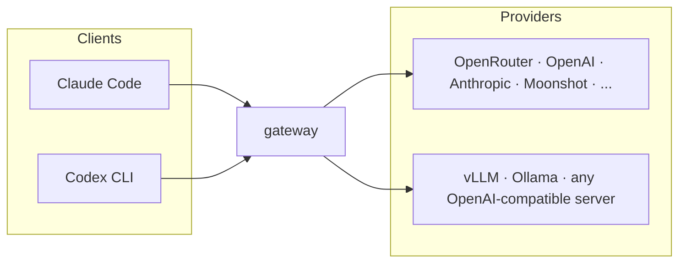

# Superagent Gateway

**A tiny Rust gateway for running coding agents across model providers safely.**

Point Claude Code and Codex at one local endpoint and run them on any model —
Kimi, GPT, Qwen, Claude, or anything OpenAI-compatible.



- **Native protocol per client.** Claude Code gets an Anthropic Messages API,
  Codex gets an OpenAI Responses API. The gateway translates bodies, streams,
  tool calls, and reasoning between them and whatever the provider speaks.
- **One config file.** Name your models once, assign them to traffic roles
  (`main`, `subagent`, `background`) per client. The name you write is the id
  you use everywhere.
- **Tool-loop-safe fallback.** Retries and failover happen only before a
  response starts streaming — a model that has begun answering or calling a
  tool is never silently swapped.
- **Small and boring on purpose.** Single binary, one YAML file, structured
  JSON logs, ~60 MB Docker image. A compatibility layer for coding agents,
  not a universal LLM platform.

## Run

```bash
cargo build --release
./target/release/gateway --config ./gateway.yaml
```

The default config path is `./gateway.yaml`. `.env.local` / `.env` are loaded
automatically for provider API keys.

### Secrets

`gateway.yaml` should never contain real secrets, and it doesn't need to:

- Provider keys are read from env vars by convention (`OPENROUTER_API_KEY`,
...) — put them in `.env.local` (gitignored, auto-loaded) or the process
environment.
- Any config value can reference an env var with `${VAR}` syntax, e.g.
`token: "${GATEWAY_TOKEN}"`. Missing variables fail at startup.
- `GATEWAY_TOKEN` / `GATEWAY_BIND` env vars override auth token and bind
address directly (handy for containers).


### Docker

```bash
docker build -t gateway .
docker run -p 4000:4000 \
  -v ./gateway.yaml:/etc/gateway/gateway.yaml:ro \
  -e OPENROUTER_API_KEY \
  gateway
```

Or `docker compose up` (see `docker-compose.yml`). The image sets
`GATEWAY_BIND=0.0.0.0:4000` so the server is reachable from outside the
container; auth tokens are mandatory for non-localhost binds, so keep a token
in the config or pass `GATEWAY_TOKEN`. Cloud platforms can probe
`GET /health` for liveness. Env overrides:

```text
GATEWAY_BIND   listen address (overrides server.bind)
GATEWAY_TOKEN  extra accepted auth token (appended to server.token/tokens)
```


## Configuration

Four sections: `server`, `providers`, `models`, `clients`.

```yaml
server:
  token: local-dev-token

providers:                       # only for what presets can't know
  azure: { resource: my-foundry }

models:
  gpt-55: azure/gpt-5.5
  kimi-27: openrouter/moonshotai/kimi-k2.7-code

clients:
  claude_code:
    main: [gpt-55, kimi-27]      # list = fallback chain, pre-stream only
    subagent: kimi-27            # Task-tool subagents (claude-opus-* ids)
    background: kimi-27          # titles/summaries (claude-haiku-* ids)
  codex:
    main: kimi-27
```

Known providers imply their base URL and key env var:


| Provider     | Key env var          | Notes                                |
| ------------ | -------------------- | ------------------------------------ |
| `openrouter` | `OPENROUTER_API_KEY` |                                      |
| `openai`     | `OPENAI_API_KEY`     |                                      |
| `anthropic`  | `ANTHROPIC_API_KEY`  | Anthropic wire protocol              |
| `moonshot`   | `MOONSHOT_API_KEY`   |                                      |
| `fireworks`  | `FIREWORKS_API_KEY`  |                                      |
| `together`   | `TOGETHER_API_KEY`   |                                      |
| `groq`       | `GROQ_API_KEY`       |                                      |
| `deepinfra`  | `DEEPINFRA_API_KEY`  |                                      |
| `deepseek`   | `DEEPSEEK_API_KEY`   |                                      |
| `mistral`    | `MISTRAL_API_KEY`    |                                      |
| `xai`        | `XAI_API_KEY`        |                                      |
| `cerebras`   | `CEREBRAS_API_KEY`   |                                      |
| `ollama`     | —                    | local, `http://localhost:11434/v1`   |
| `azure`      | `AZURE_AI_API_KEY`   | needs `resource:` under `providers:` |


Anything else is declared under `providers:` with a `base_url` (add
`type: anthropic` for Anthropic-protocol upstreams). Providers that
authenticate with custom headers instead of a bearer token — Modal endpoints,
proxies, self-hosted servers behind auth layers — can declare `headers:`,
sent verbatim on every upstream request:

```yaml
providers:
  vllm-local:
    base_url: "http://localhost:8000/v1"
    api_key: dummy
  modal:
    type: openai
    base_url: "https://my-workspace--my-endpoint.modal.run/v1"
    api_key: unused                  # auth happens via headers below
    headers:
      Modal-Key: "${MODAL_KEY}"
      Modal-Secret: "${MODAL_SECRET}"

models:
  abliterated: modal/huihui-ai/Huihui-Kimi-K2.7-Code-abliterated-GGUF
```

Known model families get capabilities from a built-in quirk table (Kimi:
fixed sampling stripped, reasoning preserved, vision; GPT/Claude: vision;
Claude: native tools + cache). Override per model with the long form:

```yaml
models:
  qwen-local:
    model: vllm-local/qwen3-coder
    images: false
    tools: openai            # openai | native | none
    thinking: none            # native | none
    drop_params: [presence_penalty]
    timeout_ms: 120000
    expose: [codex]           # hide from other clients
```

The name you give a model in `models:` is the id you use everywhere —
`claude --model kimi` and Codex's `model = "kimi"` alike. Unrecognized model
ids (Claude Code pins concrete `claude-opus-*` / `claude-haiku-*` ids for
subagents and background tasks) route to the `subagent` / `background` roles,
and anything else to `unknown` (default `main`, or `reject` to 404).

## Claude Code setup

```bash
export ANTHROPIC_BASE_URL="http://localhost:4000/anthropic"
export ANTHROPIC_AUTH_TOKEN="local-dev-token"

claude --model kimi
```


## Codex setup

Codex ignores provider/auth overrides in project-local config, so configure
the provider at user level in `~/.codex/config.toml`:

```toml
model = "main"
model_provider = "gateway"

[model_providers.gateway]
name = "Gateway"
base_url = "http://localhost:4000/openai/v1"
env_key = "GATEWAY_TOKEN"
wire_api = "responses"
```

```bash
export GATEWAY_TOKEN="local-dev-token"
codex
```


## Endpoints

```text
GET  /health
HEAD /

POST /anthropic/v1/messages               (alias: /v1/messages)
POST /anthropic/v1/messages/count_tokens  (alias: /v1/messages/count_tokens)
GET  /anthropic/v1/models                 (alias: /v1/models)

POST /openai/v1/responses                 (alias: /v1/responses)
GET  /openai/v1/models                    (alias: /v1/models)
```

Auth: `Authorization: Bearer <token>` or `x-api-key: <token>`, checked against
`auth.tokens` in the config. Binding to a non-localhost address without tokens
is refused at startup.

## Routing and fallback

Each model alias declares a per-client compatibility level (`full`, `tools`,
`degraded_tools`, `text_only`, `responses_bridge`, `blocked`) and a list of
routes with capability flags. Requests are classified (tools, tool results,
images, thinking, cache_control, streaming) and only capability-satisfying
routes are eligible.

Fallback policy:

- Retry the first route once with jitter on retryable failures
(connection errors and `fallback.retryable_statuses`), then walk the
remaining routes, capped at `fallback.max_attempts`.
- Fallback happens only before user-visible output. Once a text delta or tool
call has been streamed, a failure is surfaced to the client as an SSE error
event; the request is never silently replayed.
- Degraded routes borrowed from other models via a per-model `fallback.routes`
list require `allow_degraded_fallback: true`.
- Non-retryable upstream errors are forwarded verbatim (status and body),
because Claude Code's retry behavior depends on the original error wording.


## Observability

One structured JSON log line per attempt with `request_id`, `client`,
`model_alias`, `route_id`, `attempt`, `stream`, `status`, `fallback_used`,
`duration_ms`, and the Claude Code session id when present. Prompts are not
logged unless `telemetry.log_prompts: true`, which logs the full request body
for replay.

## Tests

```bash
cargo test
```

Unit tests cover the four body translators, the stream state machines, the
classifier, and route eligibility. Integration tests run the gateway against
mocked Anthropic and OpenAI upstreams, including pre-stream fallback on 429
and the blocked-fallback-after-output case.